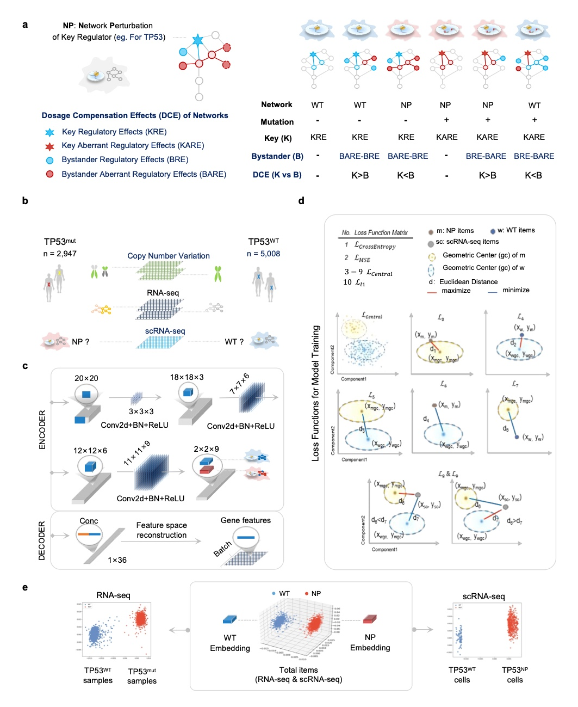

# Network Perturbation confers single-cell heterogeneity novel information dimension

The delicate and complex regulatory network is essential for the maintenance of cellular homeostasis. The presence of dosage compensation effects results in gene mutations that do not coincide with phenotypic defects. In this study, we propose the concept of Network Perturbation (NP) for regulatory factors. Instead of gene variation, NP can be used to evaluate regulatory factor-deficient phenotypes and related overall abnormal biological effects. By optimizing the comparative learning algorithm to establish the spatial projection correlation between transcriptional profiles and regulatory factor NP, we developed the pan-cancer DesNP (to Deconvolution single-cell-single-gene Network Perturbation) model. We successfully implemented the deconvolution of single-gene resolution NP patterns based on single-cell transcriptome data. NP-based analysis of cancer cell heterogeneity is a powerful tool to understand the adaptive evolutionary mechanisms in tumor targeting drug resistance and immunotherapy. Importantly, the dynamics of cancer cell NP_Entropy was significantly correlated with the potential efficacy of immune checkpoint blockade (ICB). Evaluating the individualized ICB efficacy of patients and potential intervention targets based on NP_Entropy-related information is of great clinical value.This novel dimension of NP greatly expands researchers' understanding of cellular heterogeneity and other information, and possesses an extensive range of application value.

<div align='center' ><b><font size='150'>Overview of Network Perturbation</font></b></div>



## Pre-requisites:

- Linux (Based on Ubuntu 20.04 LTS, Personal Computer) 
- CPU AMD Ryzen 9 3950X
- NVIDIA GeForce RTX 3090 24GB 384bit 1695MHz 19500MHz 
- Memory 128G (32GB*4) DDR4 3200MHz

### Environment and resource allocation

---

For instructions on installing anaconda on your machine (download the distribution that comes with python 3):
https://www.anaconda.com/distribution/

```
#conda env create -n CaSee -f configs/CaSee_env_info.yaml

# if there are some warnings or errors 
# you can manually install some main packages
# all pip software in all_pip_pacakges.yaml
conda create -n CaSee python==3.8.8 # python==3.8
conda activate CaSee

pip install pytorch-lightning==1.3.7 # -i https://pypi.tuna.tsinghua.edu.cn/simple
pip install scipy==1.7.0 # -i https://pypi.tuna.tsinghua.edu.cn/simple
pip install numpy==1.20.3 # -i https://pypi.tuna.tsinghua.edu.cn/simple
pip install scanpy==1.7.2 # -i https://pypi.tuna.tsinghua.edu.cn/simple
pip install scikit-learn==0.23.2 # -i https://pypi.tuna.tsinghua.edu.cn/simple
pip3 install opencv-python==4.5.2.54 # -i https://pypi.tuna.tsinghua.edu.cn/simple
pip install torchmetrics==0.3.2 # -i https://pypi.tuna.tsinghua.edu.cn/simple
pip install torchvision==0.10.0 # -i https://pypi.tuna.tsinghua.edu.cn/simple

```

And you also download pytorch https://pytorch.org/ 

Attention, if you in the Chinese mainland, plz use `pip install` instand `conda install` 

**Ubuntu**

```
pip3 install torch==1.9.0+cu111 torchvision==0.10.0+cu111 torchaudio==0.9.0 -f https://download.pytorch.org/whl/torch_stable.html


```

**MacOS**

```
pip3 install torch==1.9.0 torchvision==0.10.0 torchaudio==0.9.0


```

**Windos**

```
pip3 install torch==1.9.0+cu111 torchvision==0.10.0+cu111 torchaudio==0.9.0 -f https://download.pytorch.org/whl/cu111/torch_stable.html
```
> torch==1.9.0+cu111  
> torchvision==0.10.0+cu111  
> torchaudio==0.9.0
> ## Prepare candidate ref data

Download `ref_data.tar.xz` and unzip the file, move the whole `ref_data` into the CaSee program work_dir.


## Running Model

```
python runNP.py \
    -g $genes \
    -s 'ref/GSE116237_Candidate_cancer_expr.h5' \
    -b 'ref/runNP_ref.h5' \
    -o 'Pan_cancer_Pathyway_detection/GSE116237/Pan_cancer_'$id \
    --lr 1e-4 \
    --batch_size 128 \
    --max_epoch 100 \
    --n_neighbors_pseudo 30 \
    --cl_weight 0.895
```
